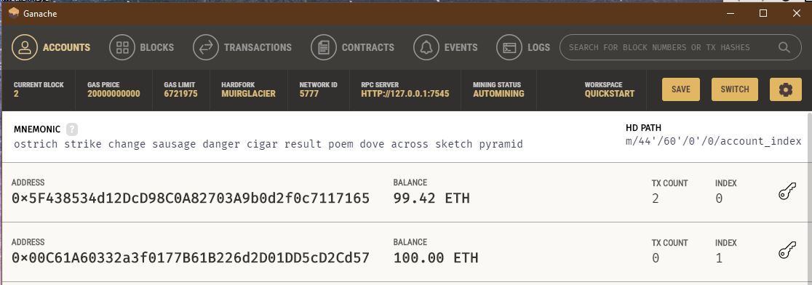

<h1 align="center">Cryptocurrency Wallet</h1>
<h3 align="center">Ganache & Streamlit dApp</h3>

  
    <section></section>
    <section> <b> By: Ebad Salehi </b> </section>

  

———————— ≡≡≡≡≡≡ ————————
 
<!-- TABLE OF CONTENTS -->

  
 <b>Table of Contents</b>

  <ul>
        <li><a href="#Glance"> At A Glance</a> </li>
        <li><a href="#Screenshots"> Screenshots</a></li>
        <li><a href="#Code">Source Code</a></li>
        <li><a href="#Tech">Libraries Used</a></li>
        <li><a href="#Author">Author</a></li>
  </ul>

———————— ≡≡≡≡≡≡ ————————

 

## At A Glance

work at a startup that is building a new and disruptive platform called Fintech Finder. Fintech Finder is an application that its customers can use to find fintech professionals from among a list of candidates, hire them, and pay them. As Fintech Finder’s lead developer, you have been tasked with integrating the **Ethereum blockchain network** into the application in order to enable your customers to instantly pay the fintech professionals whom they hire with cryptocurrency.
 

## Streamlit dApp Screenshot

(<a href="#top">Back to top</a>)

    
 

## Source Code

[fintech_finder.py](fintech_finder.py)
 

[crypto_wallet.py](crypto_wallet.py)
 

## Libraries Used

* Ganache
* streamlit
* dataclass
* typing

 

## Author
Ebad Salehi

(<a href="#top">Back to top</a>)

    
 
